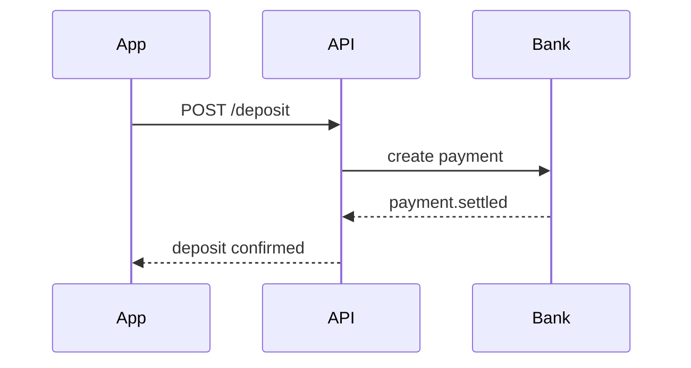
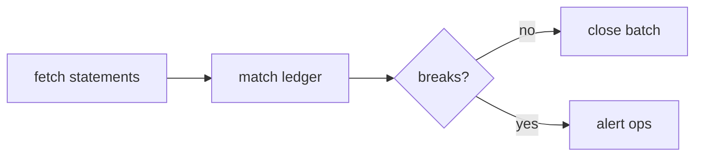

# Payment service

Deposits move from the customer's bank into the client money wallet,
then settle into the investment account.



Reconciliation runs nightly:



Plain code blocks pass straight through:

```sql
select count(*) from deposits where settled_at is null;
```
